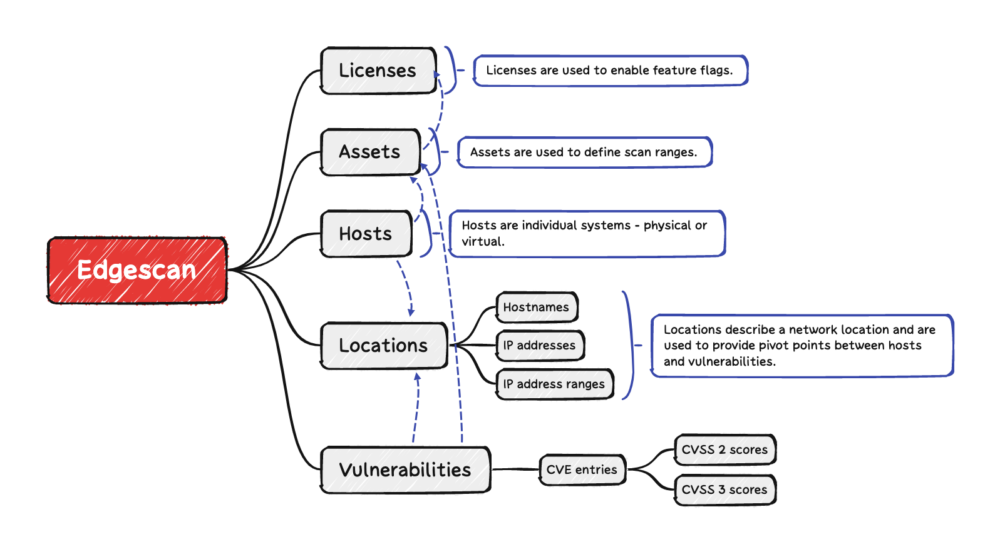
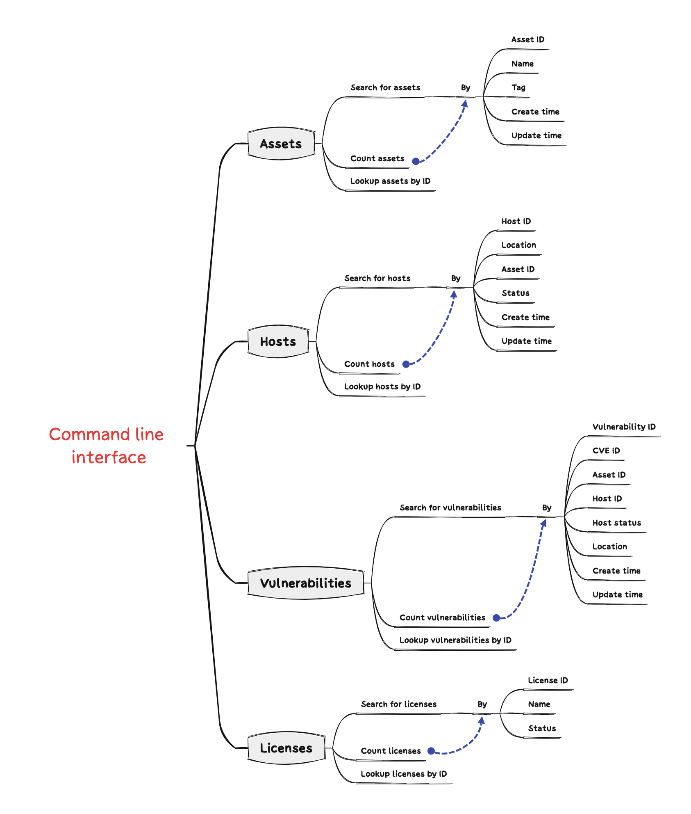

# An API client for Edgescan

---

## Overview

### Edgescan

[Edgescan](https://www.edgescan.com/) is a vulnerability management solution that allows you to identify both network and application layer vulnerabilities across a wide variety of systems.

### Data model



Edgescan's data model includes:
- **Assets**: define which _hosts_ to scan for _vulnerabilities_;
- **Hosts**: represent individual computer systems (physical or virtual); and 
- **Vulnerabilities**: represent known attack vectors that may be exploited by an adversary.

### Caveats

- Since hosts and vulnerabilities are linked by location (i.e. by IP address or hostname) rather than using stronger factors such as UUIDs, any two hosts that have the same IP address or hostname will have the same vulnerabilities.

---

## API client

This API client is written in Python and includes a command line interface that you can use to list, count, and retrieve objects.

### Features

You can use this package to:

- List, count, and retrieve assets, hosts, licenses, and vulnerabilities; and
- Export data from Edgescan in JSONL format

### Disclaimers

- This package is not maintained by, or supported by Edgescan.

### Warnings

- The latest version of all hosts, licenses, and vulnerabilities will be written to the system's temporary directory by default <sub>1</sub>.

<sub>1. You can disable this behaviour by setting `EDGESCAN_ENABLE_CACHE=false`</sub>

---

### Installation

To install the `edgescan-api-client` (requires [`poetry`](https://github.com/python-poetry/poetry)):

```shell
$ git clone https://github.com/whitfieldsdad/edgescan-api-client.git
$ cd edgescan-api-client
$ make install
```

#### Environment variables

| Name                    | Description                                    | Default           | Required |
|-------------------------|------------------------------------------------|-------------------|----------|
| `EDGESCAN_HOST`         | Address of Edgescan API                        | live.edgescan.com | false    |
| `EDGESCAN_API_KEY`      | Edgescan API key                               | n/a               | true     |
| `EDGESCAN_ENABLE_CACHE` | Enable/disable caching to temporary directory. | n/a               | false    |

---

### Testing

To run the unit tests and integration tests:

```shell
$ make test
```

#### Code coverage

Code coverage reports will automatically be created in two different formats:
- HTML: `coverage/html/index.html`
- JSON: `coverage/json/coverage.json`

To read the HTML-formatted code coverage report:

```shell
$ open coverage/html/index.html
```

To read the JSON-formatted code coverage report:

```shell
$ cat coverage/json/coverage.json | jq
```

---

### Docker

This repository has been packaged as a Docker container! ✨📦🐋✨

#### Building the container

To build the container:

```shell
$ make build-container
```

#### Exporting the container to a file

To export the container to a file named `edgescan-api-client.tar.gz`:

```shell
$ make export-container
$ du -sh edgescan-api-client.tar.gz
176M    edgescan-api-client.tar.gz
```

---

### General usage

There are two different ways to interact with this module:
- Via the command line; or
- Via Python

#### Command line interface

Using `poetry`:

```shell
$ poetry run edgescan
Usage: edgescan [OPTIONS] COMMAND [ARGS]...

Options:
  --edgescan-host TEXT
  --edgescan-api-key TEXT
  --help                   Show this message and exit.

Commands:
  assets           Query or count assets.
  hosts            Query or count hosts.
  licenses         Query or count licenses.
  vulnerabilities  Query or count vulnerabilities.
```



##### Search for assets

You can search for assets by:
- Asset ID;
- Name;
- Tag;
- Create time; and/or
- Update time

```shell
$ poetry run edgescan assets get-assets --help
Usage: edgescan assets get-assets [OPTIONS]

  Search for assets.

Options:
  --asset-ids TEXT
  --names TEXT
  --tags TEXT
  --min-create-time TEXT
  --max-create-time TEXT
  --min-update-time TEXT
  --max-update-time TEXT
  --limit INTEGER
  --help                  Show this message and exit.
```

#### Search for hosts

You can search for hosts by:

- Asset ID;
- Host ID;
- Location (i.e. by IP address or hostname);
- Status (i.e. whether they're "dead" or "alive");
- Create time; and/or
- Update time.

```shell
$ poetry run edgescan hosts get-hosts --help
Usage: edgescan hosts get-hosts [OPTIONS]

  Search for hosts.

Options:
  --asset-ids TEXT
  --host-ids TEXT
  --locations TEXT
  --alive / --dead
  --min-create-time TEXT
  --max-create-time TEXT
  --min-update-time TEXT
  --max-update-time TEXT
  --limit INTEGER
  --help                  Show this message and exit.
```

##### Count active vs. inactive hosts

You can count active hosts like this:

```shell
$ poetry run edgescan hosts count-hosts --alive
123
```

And inactive hosts like this:

```shell
$ poetry run edgescan hosts count-hosts --dead
456
```

#### Search for vulnerabilities

You can search for vulnerabilities by:
- Vulnerability ID;
- CVE ID;
- Asset ID;
- Host ID;
- Location (i.e. by IP address or hostname);
- Status (i.e. whether the host is "dead" or "alive");
- Layer (i.e. "app" layer or "network" layer);
- Create time;
- Update time

```shell
$ poetry run edgescan vulnerabilities get-vulnerabilities --help
Usage: edgescan vulnerabilities get-vulnerabilities [OPTIONS]

  List vulnerabilities.

Options:
  --vulnerability-ids TEXT
  --cve-ids TEXT
  --asset-ids TEXT
  --host-ids TEXT
  --locations TEXT
  --alive / --dead
  --include-application-layer-vulnerabilities / --exclude-application-layer-vulnerabilities
  --include-network-layer-vulnerabilities / --exclude-network-layer-vulnerabilities
  --min-create-time TEXT
  --max-create-time TEXT
  --min-update-time TEXT
  --max-update-time TEXT
  --limit INTEGER
  --help                          Show this message and exit.
```

#### Search for licenses

You can search for licenses by:
- License ID;
- License name; and/or
- Whether the license is expired.

```shell
$ poetry run edgescan licenses get-licenses --help
Usage: edgescan licenses get-licenses [OPTIONS]

  List licenses.

Options:
  --license-ids TEXT
  --license-names TEXT
  --expired / --not-expired
  --limit INTEGER
  --help                     Show this message and exit.
```

---

#### Python

##### Search for assets

To look up all assets and list their names:

```python
from edgescan import Client

api = Client()
assets = api.iter_assets()

names = {asset['name'] for asset in assets}
print(', '.join(sorted(names)))
```

##### Search for hosts

To look up all active hosts and list their locations (i.e. IP addresses and hostnames):

```python
from edgescan import Client

api = Client()
locations = set()
for host in api.iter_hosts(alive=True):
    locations |= {host['location']} | set(host['hostnames'])

print(', '.join(sorted(locations)))
```

To look up all active hosts and their OS versions:

```python
from edgescan import Client

api = Client()
os_versions = {host['os_name'] for host in api.iter_hosts(alive=True) if host['os_name']}
print(', '.join(sorted(os_versions)))
```

To count active hosts by OS type and OS version:

```python
from edgescan import Client
from collections import OrderedDict

import edgescan.platforms
import collections
import json

api = Client()

tally = collections.defaultdict(lambda: collections.defaultdict(int))
for host in api.iter_hosts(alive=True):
    os_version = host['os_name']
    if os_version:
        os_type = edgescan.platforms.parse_os_type(os_version)
        tally[os_type][os_version] += 1

#: Sort by rate of occurrence.
tally = OrderedDict(sorted(tally.items(), key=lambda e: e[1], reverse=True))
print(json.dumps(tally, indent=4))
```

##### Search for licenses

To search for licenses and list their names:

```python
from edgescan import Client

api = Client()
names = {row['name'] for row in api.iter_licenses()}
print(', '.join(sorted(names)))
```

##### Search for vulnerabilities

To count vulnerabilities on active hosts:

```python
from edgescan import Client

api = Client()
total = api.count_vulnerabilities(host_is_alive=True)
print(total)
```

To count vulnerabilities on active hosts by CVE ID:

```python
from edgescan import Client
from collections import OrderedDict

import collections
import json

api = Client()

tally = collections.defaultdict(int)
for vulnerability in api.iter_vulnerabilities(host_is_alive=True):
    for cve_id in vulnerability['cves']:
        tally[cve_id] += 1

#: Sort by rate of occurrence.
tally = OrderedDict(sorted(tally.items(), key=lambda e: e[1], reverse=True))
print(json.dumps(tally, indent=4))
```
